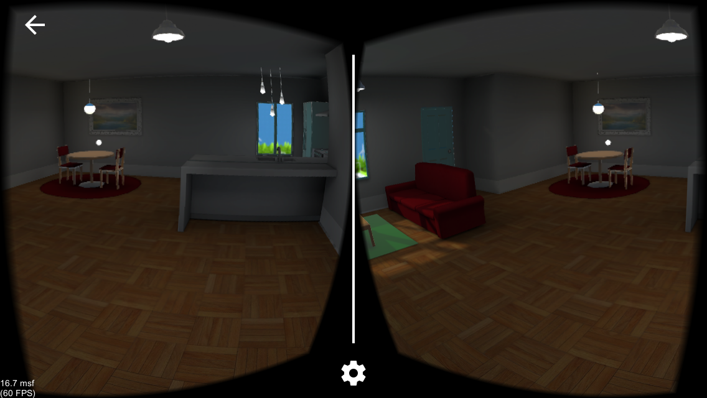

## Project Name
Apartment in VR

## Description
This is a small VR project where the user will be able to explore a small apartment in VR. The initial 3D assets were provided. I placed them, as well as, lights and cameras.

## Submission Notes
* Submitting for iOS

## Technologies
Unity, C#, Android Studio and Xcode (Used for deployment).
Note: Google VR SDK was not used in this project.

## Current Features
* User will start in an apartment and look around.
* User will be able to move around the apartment.

## Future Features

## Usage
* Click "Download" on
[https://github.com/Mehequanna/UnityVR-ApartmentProject](https://github.com/Mehequanna/UnityVR-ApartmentProject)
* Open Unity and choose open project (You will need to know the repo location)

### To Run On Your Device
* On Mac, choose File -> Build Settings
* In platform, choose the platform you have set up, either iOS or Android. Select "Switch Platform".
* Choose "Build and Run" at the bottom right.

## Known Issues
* This project will need to be opened in Unity 5.5.1

## Author
Stephen Emery

## License
This work can be used under the MIT License.
Copyright (c) 2017 Stephen Emery
